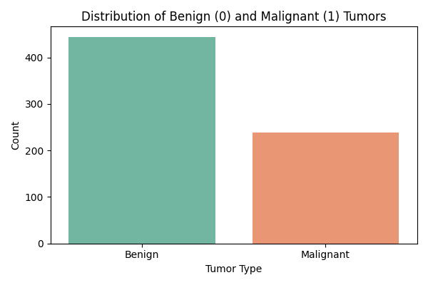
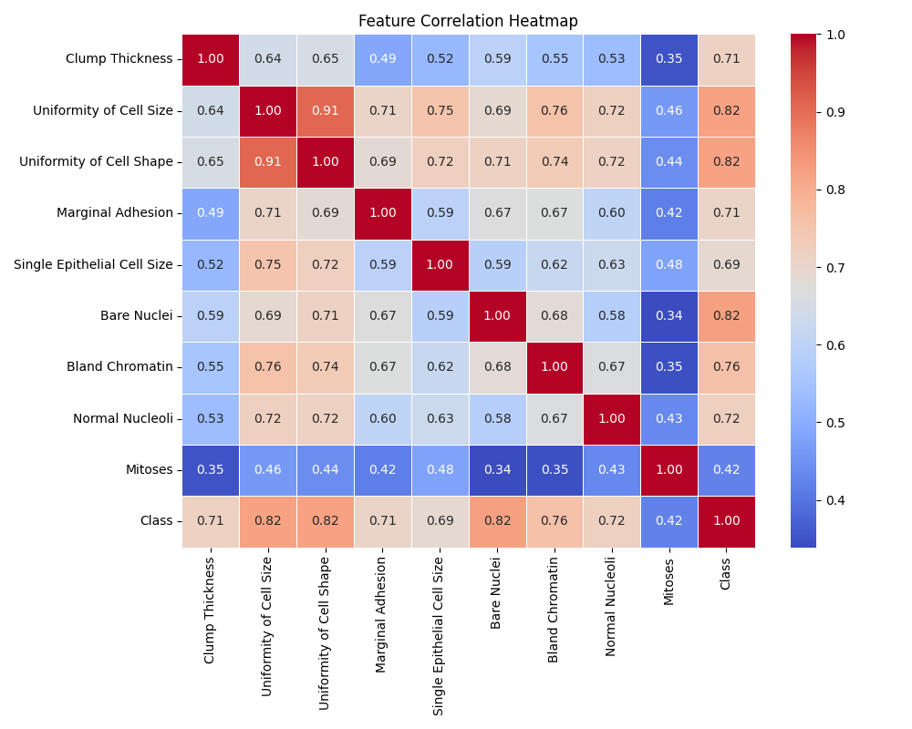
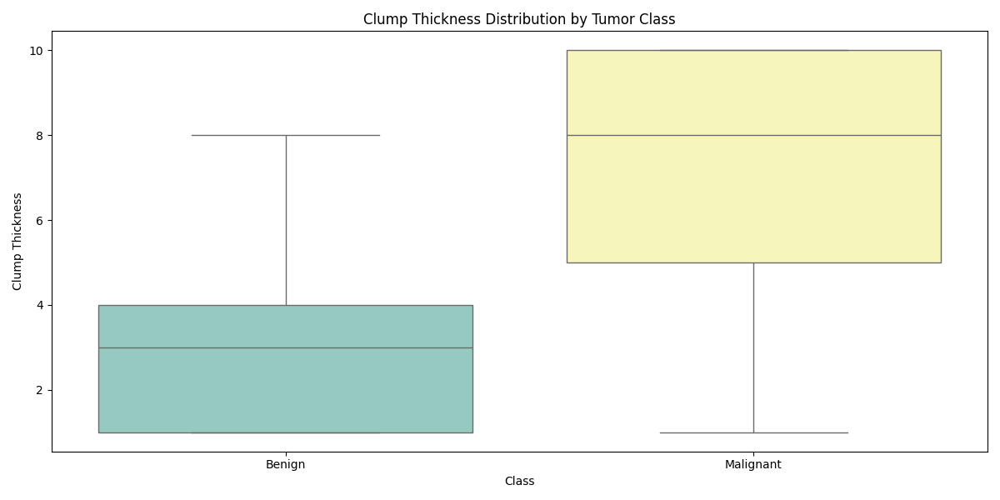
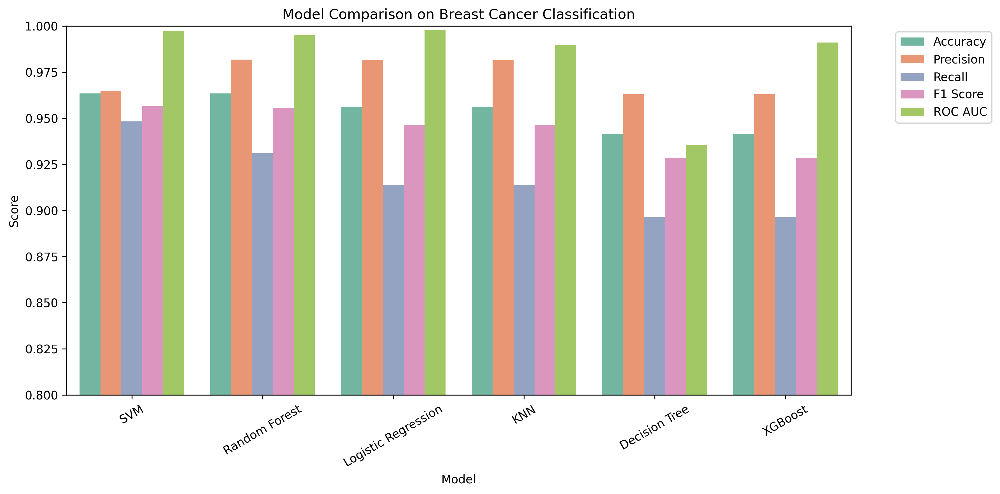
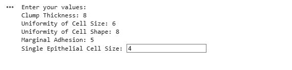
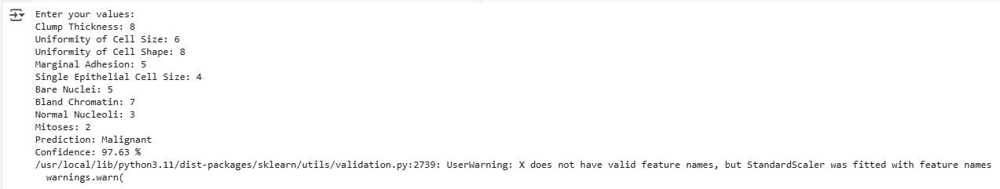

# OncoVision 🔬🧠

**OncoVision** is a machine learning-based diagnostic tool that predicts whether a breast tumor is **benign** or **malignant**, using the Breast Cancer Wisconsin (Original) dataset from the UCI Machine Learning Repository.

It features multiple ML classifiers with model comparison, clean visualizations, and the ability to predict tumor types based on user input.

---

## 📈 Project Overview

| Task         | Description                                |
|--------------|--------------------------------------------|
| Dataset      | Breast Cancer Wisconsin (Original)         |
| Goal         | Classify tumors as Benign (0) or Malignant (1) |
| Techniques   | Logistic Regression, SVM, Random Forest, XGBoost |
| Metrics      | Accuracy, Precision, Recall, F1, ROC-AUC   |

---

## 🖼️ Visualizations

### 🔹 Class Distribution


### 🔹 Correlation Heatmap


### 🔹 Feature Boxplot


### 🔹 Model Performance Comparison


---

## ⚙️ How to Run

1. Clone the repository:
   ```bash
   git clone https://github.com/your-username/OncoVision.git
   cd OncoVision
   ```

2. Open `OncoVision.ipynb` in **Google Colab** or Jupyter Notebook.

3. Run all cells — the notebook handles preprocessing, model training, evaluation, and visualization.

---

## 🧪 Predict on Your Own Data (Interactive Input)

You can enter a new sample manually through the console and let the model predict its classification with confidence:





---

## 🧠 Technologies Used

- Python (Scikit-learn, Pandas, Seaborn, Matplotlib)
- XGBoost
- Google Colab / Jupyter Notebook
- UCI Machine Learning Repository

---

## 📁 Dataset Source

> **Wolberg, William.** *"Breast Cancer Wisconsin (Original)."*  
> UCI Machine Learning Repository, 1990.  
> [https://doi.org/10.24432/C5HP4Z](https://doi.org/10.24432/C5HP4Z)

---

## 💡 Future Enhancements

- Deploy as a web app using Flask/Streamlit
- Add cross-validation and grid search
- Integrate SHAP for model interpretability

---

